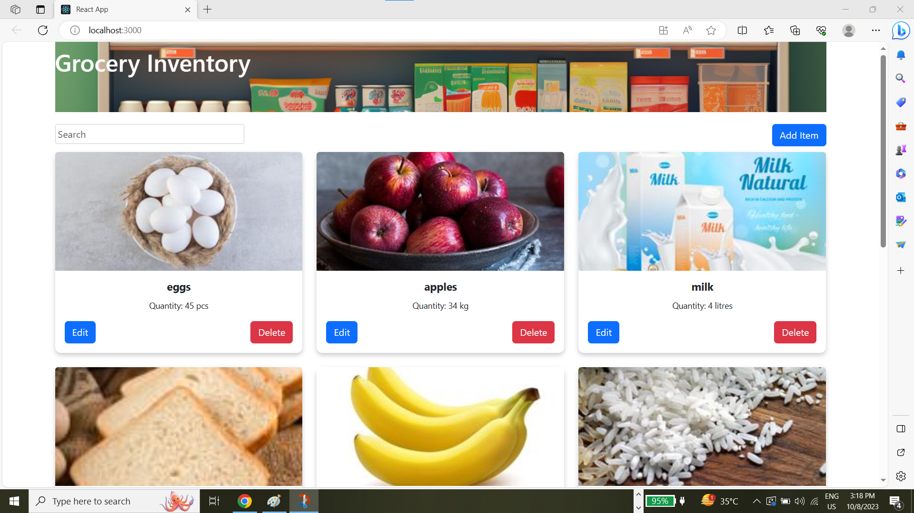
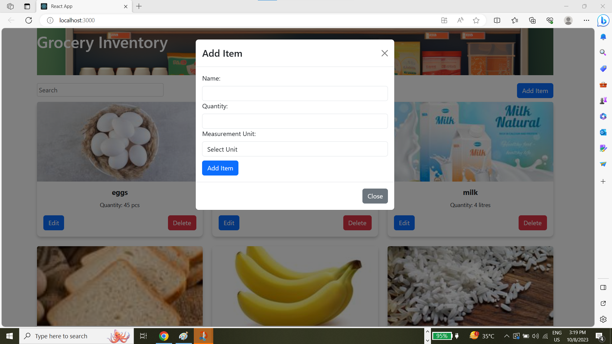
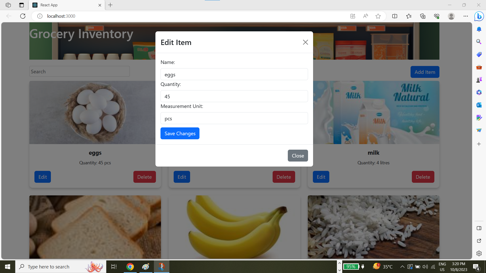
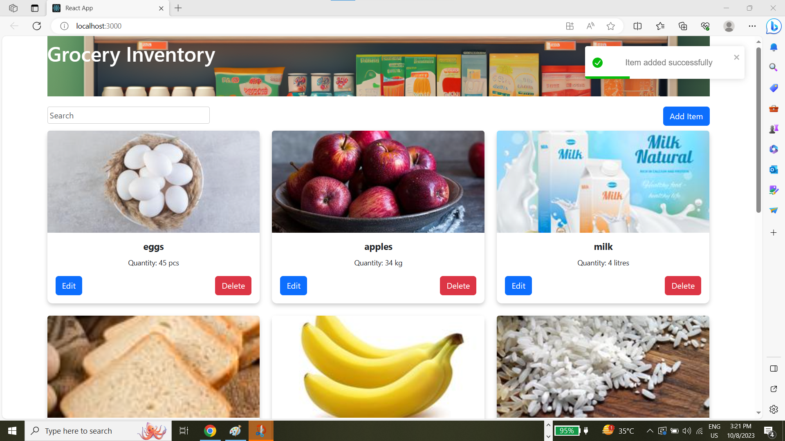

# Welcome to Our Grocery Inventory App!
Are you tired of losing track of your groceries or struggling to remember what you need at the store? Look no further! Our Grocery Inventory App is here to make your life easier and more organized.

Card View: Easily view all your groceries in a card format.
Effortless Search: Quickly find items you need.
Edit, Delete, Add: Manage your inventory with ease.
Stay Organized: Keep your kitchen well-organized.
Sync Across Devices: Access your inventory from anywhere.
Save Time and Money: Reduce waste and save money

## Landing page 

## Prerequisites
Node.js and npm installed.

MongoDB Atlas account or local MongoDB instance.

## Getting Started
Clone the repository

`git clone https://github.com/mohdishaq786/ctpoint5_Assignment.git`

`cd ctpoint5_Assignment`

## Install Dependencies

After cloning the repository, navigate to the root directory and run:

`npm install`
 navigate to `cpoint5_Assigment/fontend/grocery-app` & run this `npm install react-scripts --save`

This will also install frontend dependencies thanks to the postinstall script.

## Configuration
Make sure to set up your MongoDB URI in the backend configuration. You can either:

Directly set the URI in your backend code (not recommended for production).

Use environment variables (recommended). Set MONGO_URI in your environment, or create a .env file in your backend directory with:
`MONGO_URI=your_mongo_connection_string`

## or use  can use my url for testing purpose you do  not need to do any thing it already in the code of #config

## Running the application
After setting up the database connection, you can start both the backend and frontend with:

 `npm run dev`

The backend will start, by default, on port 5000, and the frontend will be available on port 3000.

## Features

- Add Grocery Item: Allows users to add new grocery items to the inventory.
- List Grocery Items: Displays all the grocery items in the inventory.
- Update Grocery Item: Enables users to modify the details of a grocery item.
- Delete Grocery Item: Allows users to remove a grocery item from the inventory.
- Search Grocery item:Allows users to search grocery item by name

## API Endpoints :

- `GET api/grocery`: Retrieve all grocery items.
- `POST api/grocery/addGrocery`: Add a new grocery item.
- `PUT api/grocery/id`: Update a specific grocery item.
- `DELETE api/grocery/id:` Delete a specific grocery item.

## Test Api endpoints with Postman
- First start backend sever `npm start`
- URL for #`http://localhost:5000/api/ `
- Fetch -> # `http://localhost:5000/api/grocery`
- Add- > # `http://localhost:5000/api/grocery/addGrocery`
- Update -> #`http://localhost:5000/api/grocery/id`
- Delete -> # `http://localhost:5000/api/grocery/delete`

## Images of Features

# landing Page

# Add Modal

# Edit Modal

# Feedback of API responses

